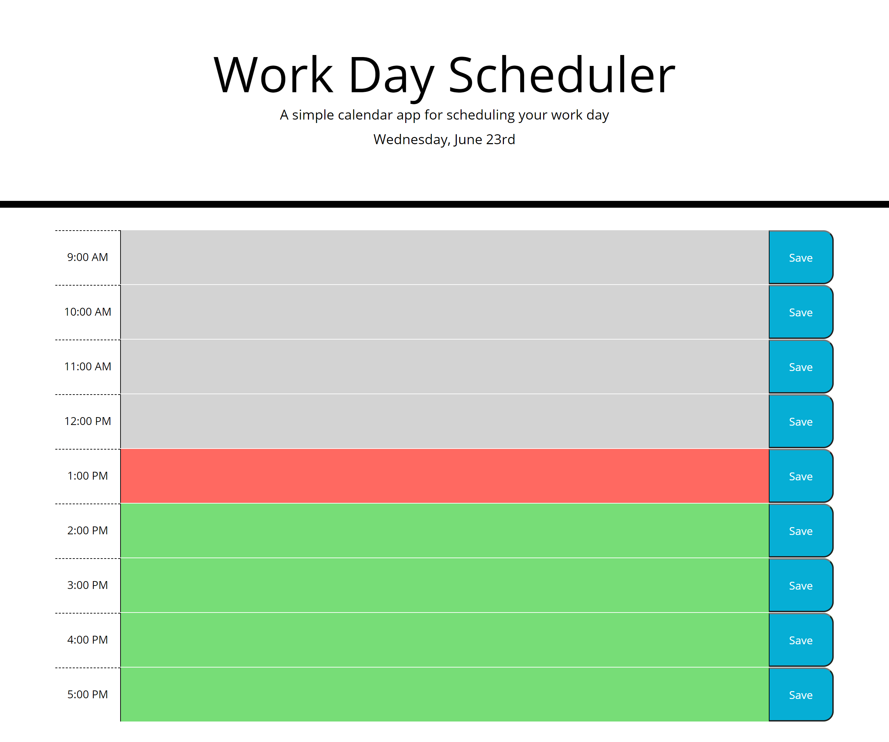

# hw5-work-day-scheduler

## link
launch day planner [here](https://karina5151.github.io/hw5-work-day-scheduler/)

## My Task
    In this assignment my goal was to create a basic day planner app that loops through the hours of 9am - 5pm, always updating to the current day's date. The app uses moment.js, JQuery, and Bootstrap for functionality as well as local storage for saving the user's information to thier specific browser.
 

## Mock-Up

The following image shows the web page's appearance upon completion:
